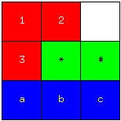

# tinydraw
tynydraw (under construction)

----

```javascript
// 描画スクリプトのサンプル
setParams(50, 50);
setGrid(4, 4);

setBgColor("white");

setFgColor("red");
fillGridSquare(0, 0, 2, 2);

setFgColor("green");
fillGridSquare(1, 1, 3, 2);

setFgColor("blue");
fillGridSquare(0, 2, 3, 3);

setFgColor("black");
drawGridSquares()

setFgColor("white");
drawText(25, 30, "1");
drawText(75, 30, "2");
drawText(25, 80, "3");

setFgColor("black");
drawText(75, 80, "*");
drawText(125, 80, "#");

setFgColor("yellow");
drawText(25, 130, "a");
drawText(75, 130, "b");
drawText(125, 130, "c");

saveFile("sample1.png");
```


